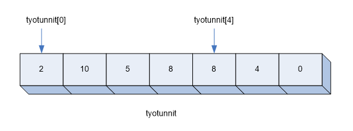

# [Taulukot](https://developer.mozilla.org/en-US/docs/Web/JavaScript/Reference/Global_Objects/Array)
Taulukko on tietorakenne, joka koostuu joukosta alkioita.
Taulukon käytön ansiosta ei tarvitse keksiä suurta joukkoa muuttujanimiä, vaan
kaikkiin taulukossa olevia arvoja - eli taulukon alkioita - voidaan
käyttää yhden muuttujan kautta.

Esimerkiksi voitaisiin luoda seuraavanlaiset taulukot:
- seitsenalkioinen kokonaislukutaulukko, joka sisältää henkilön työtunnit viikon kunakin päivänä.
- neljäalkioinen merkkijonotaulukko, joka sisältää neljän pelaajan nimet.
- 500-alkioinen liukulukutaulukko, joka sisältää viisisataa arvottua satunnaislukua.

Esimerkiksi työtuntitaulukko voitaisiin visualisoida seuraavasti:


Taulukon alkioihin viitataan taulukkomuuttujan nimellä ja indeksillä.

Esimerkissä `tyotunnit` on taulukkomuuttujan nimi, ja luvut 0 ja 4 ovat indeksejä.
Indeksit voivat vaihdella esimerkissä välillä 0..6.

Taulukon työtunnit viidenteen alkioon viitataan ilmauksella `tyotunnit[4]`. Numerointi alkaa
nollasta, ja taulukon indeksi on aina yhtä pienempi kuin taulukon koko - eli alkioiden määrä taulukossa.

JavaScript-ohjelmointikieli ei edellytä, että kaikki taulukon alkiot ovat saman tyyppisiä. Niinpä
voitaisiin luoda esimerkiksi taulukko, jossa osa alkioista on kokonaislukuja ja
osa merkkijonoja. Tämä on kuitenkin harvoin tarkoituksenmukaista.

## Taulukkomuuttujan määritys ja taulukon luonti

Taulukon käyttöönotto koostuu taulukkomuuttujan määrityksestä ja taulukon luonnista.

Seuraava lause luo taulukkomuuttujan nimeltä luvut, jonka arvona on aluksi tyhjä taulukko.
```javascript
        let luvut = [];
```

Lisätään taulukkoon sen jälkeen kolme alkiota:
```javascript
        luvut[0] = 17;
        luvut[1] = 2;
        luvut[2] = 8;
```        
Vaihtoehtoisesti taulukko voitaisiin luoda kirjoittamalla sen
sisältö suoraan lauseeseen, jossa taulukkomuuttuja määritellään:
```javascript
        luvut = [17,2,8];
```    

Huomaa, että taulukon kokoa ei tarvitse tietää taulukkoa luotaessa.
Taulukkoon voidaan sen luonnin jälkeen lisätä haluttu määrä alkioita.

Taulukon koko määräytyy suurimman käytetyn indeksin mukaan. Koko on yhtä suurempi kuin suurin indeksi.
Taulukon `luvut` koko saadaan tarvittaessa lausekkeesta `luvut.length`.

## Taulukon läpikäynti

Taulukko voidaan läpikäydä helposti toistorakenteessa.
Seuraava ohjelma arpoo kymmenen nopanheiton tulosta.
Tulokset esitetään ensin heittojen yhteydessä alkuperäisessä järjestyksessä
 ja sen jälkeen käänteisessä järjestyksessä.

```javascript
        const HEITOT = 5;
        let i, tulos;
        let heitot = [];

        for (i = 0; i<HEITOT; i++) {
            tulos = Math.floor(Math.random()*6)+1;
            console.log('Heiton ' + (i+1) + ' tulos: ' + tulos);
            heitot[i] = tulos;
        }
        console.log('Takaperin:')
        for (i = HEITOT-1; i>=0; i--) {
            console.log('Heiton ' + (i+1) + ' tulos: ' + heitot[i]);
        }
```

Esimerkki tulosteesta:
```
Heiton 1 tulos: 6
Heiton 2 tulos: 3
Heiton 3 tulos: 4
Heiton 4 tulos: 3
Heiton 5 tulos: 2
Takaperin:
Heiton 5 tulos: 2
Heiton 4 tulos: 3
Heiton 3 tulos: 4
Heiton 2 tulos: 3
Heiton 1 tulos: 6
```

## Harva taulukko

Sellaista taulukkoa, jossa vain osaa alkioista käytetään, kutsutaan harvaksi taulukoksi.
Ideana on käyttää taulukkoa sen kirjaamiseen, onko jokin arvo jo käytetty.

Tarkastellaan esimerkkinä lottorivin arpovaa ohjelmaa. Ohjelma kysyy numeroiden kokonaismäärän
ja arvottavien numeroiden määrän.
Aluksi kaikki numerot alustetaan käyttämättömiksi.
Kun jokin numero on arvottu, vastaava alkio merkitään taulukosta käytetyksi.
Kunkin lottoriviin tulevan numeron arvonta toistetaan niin monta kertaa, kunnes saadaan käyttämätön numero.
Näin samaa numeroa ei tule valittua lottoriviin kahteen kertaan.

Alla on arvonnan toteuttava ohjelmakoodi:
```javascript
       let kaytetty = [];
       let numerot, arvottavat;
       let i, r;

       numerot = prompt('Monestako numerosta valitaan? ');
       arvottavat = prompt('Montako numeroa arvotaan?');

       for (i = 0; i<arvottavat; i++) {
           do {
               r = Math.floor(Math.random()*numerot)+1;
           } while (kaytetty[r]);
           kaytetty[r] = true;
           console.log(r);
       }
```

Esimerkki tulosteesta, kun valitaan seitsemän numeroa 40:stä:
```
11
23
24
9
27
36
16
```

## Taulukkometodeja

JavaScript-taulukolle voidaan soveltaa valmiiksi ohjelmoituja metodeja, joilla taulukkoa muokataan.
Näitä metodeja ovat esimerkiksi:

- `sort()`	lajittelee taulukon aakkosjärjestykseen
- `reverse()`	vaihtaa taulukon alkiot käänteiseen 	järjestykseen
- `shift()`	poistaa ja palauttaa taulukon 1. alkion
- `pop()`	poistaa ja palauttaa taulukon viimeisen 	alkion
- `push(alkioluettelo)`	lisää taulukon loppuun luetellut, pilkuilla 	erotellut alkiot

Metodeja kutsutaan siten, että ensin kirjoitetaan taulukkomuuttujan nimi, sen jälkeen piste ja lopuksi metodin nimi.
Esimerkiksi taulukko nimeltä `luvut` lajitellaan kirjoittamalla `luvut.sort()`.

## Harjoitustehtävät

1. Kirjoita ohjelma, joka kysyy käyttäjältä viisi lukua ja tulostaa ne vastakkaisessa järjestyksessä kuin ne syötettiin. (2p)

     - Tehtävä on ratkaistava taulukkomuuttujan avulla.

2. Kirjoita ohjelma, joka kysyy käyttäjältä osallistujien määrän. Tämän jälkeen ohjelma kysyy kaikkien osallistujen nimet.
Lopuksi ohjelma tulostaa osallistujien nimet web-sivulle numeroituun luetteloon samassa järjestyksessä kuin ne syötettiin. (3p)

3. Kirjoita ohjelma, joka kysyy kuuden koiran nimet.
Ohjelma tulostaa koirien nimet numeroimattomaan luetteloon (`<ul>`) käänteisessä aakkosjärjestyksessä. (3p)

4. Kirjoita ohjelma, joka kysyy käyttäjältä lukuja, kunnes hän antaa nollan. Tämän jälkeen annetut luvut tulostetaan suurimmasta pienimpään. (3p)

5. Kirjoita ohjelma, joka kysyy käyttäjältä väliltä 1..1000 olevia lukuja, kunnes hän antaa uudelleen jonkin aiemmin antamansa luvun. Tuolloin ohjelma ilmoittaa, että luku on jo annettu ja lopettaa toimintansa. (3p)

6. Kirjoita ohjelma, joka kysyy käyttäjältä lukuja, kunnes käyttäjä antaa nollan. Tämän jälkeen ohjelma tulostaa annettujen lukujen mediaanin. (3p)
   
     - Mediaani on se luku, joka on suuruusjärjestyksessä keskimmäisin.
     - Jos lukuja on parillinen määrä, on mediaani kahden suuruusjärjestyksessä keskimmäisen luvun keskiarvo.
     - Huomaa, että nolla on vain lopetusmerkki. Sitä ei saa käsitellä mukana olevana lukuna mediaania laskettaessa.
     
7. Kirjoita alla olevan kuvauksen mukainen äänestysohjelma pienimuotoiseen kokouskäyttöön. (3p)
    - Ohjelma kysyy ehdokkaiden lukumäärän. Jos ehdokkaita on esimerkiksi 5, saavat he äänestysnumerot 1, 2, ..., 5. (Tämän jälkeen ehdokkaat voisivat sopia keskenään ja ilmoittaa äänestäjille, mikä on kunkin ehdokkaan äänestysnumero.)
    - Ohjelma kysyy äänestäjien lukumäärän.
    - Ohjelma kysyy vuoron perään kultakin äänestäjältä, ketä tämä äänestää. Jos äänestäjä syöttää äänestysnumeron sijasta nollan, tulkitaan se tyhjäksi ääneksi.
    - Ohjelma ilmoittaa vaalien voittajan (eli hänen äänestysnumeronsa).

 
